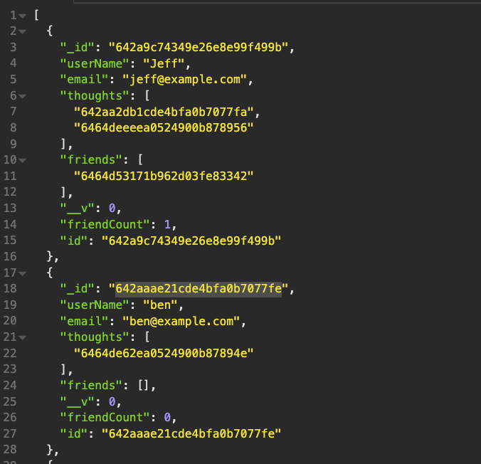

# Frend Zone - NoSQL Social Media API

[See this server app running!](https://drive.google.com/file/d/1tpFJGEPwr0GR0h1dm5S0MY_Hu1CcU4Yw/view?usp=sharing)
## Description
This application is an api for a Social Media apps. It uses NoSQL to process data in the database.

In this app, a user can create an account, add friends, make posts and add reactions to other user's posts! 

## Table of Contents
  [Description](#description)

  [Installation](#installation)

  [Technologies](#technologies-used)

  [Tests](#tests)

  [Questions](#questions)
  
  [License](#license)

## Installation
Make a clone using this link: [git@github.com:RyanMcd29/e-commerce_backend.git](git@github.com:RyanMcd29/e-commerce_backend.git)

Navigate to directory using gitBash/terminal. 

Use command 'npm install' to install the required packages.

## Technologies Used
- NoSql
>MongoDB

> Mongoose

- Express
## Tests
Use insomnia to make a remote connection to send requests to the server.
## Questions
Created by [RyanMcd29](https://github.com/RyanMcd29).
If you have any questions about this project please contact me at [ryan.mcdiarmid45@gmail.com](mailto:ryan.mcdiarmid45@gmail.com).

## License
Licensed for use under <a href=https://opensource.org/licenses/MIT>MIT</a> for more information please see [license](./license) in repo.
